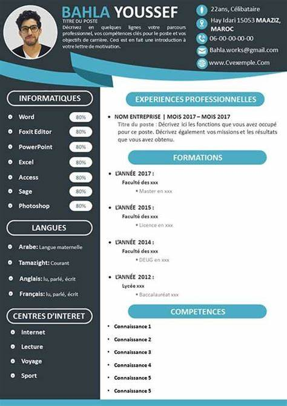

# **Tahir CV Project Style Guide**

**Template**

**Colors**

1. primary.light `#e3f2fd`
2. palette.primary.main `#90caf9`
3. palette.primary.dark `#42a5f5`

**Info**

1. palette.info.light `#4fc3f7`
2. palette.info.main `#29b6f6`
3. palette.info.dark `#0288d1`

Main Body Color Green
Background Color - #1e4040

Model Green color
#313c40

Font
Name: **LATO**
Font Weight 400, 700, 900

`<link rel="preconnect" href="https://fonts.googleapis.com">`
`<link rel="preconnect" href="https://fonts.gstatic.com" crossorigin>`
`<link href="https://fonts.googleapis.com/css2?family=Lato:wght@400;700;900&display=swap" rel="stylesheet">`

CSS: `font-family: 'Lato', sans-serif;`

Icons

1. Male `<i class="fa-solid fa-person"></i>`
2. Location `<i class="fa-solid fa-location-dot"></i>`
3. Phone `<i class="fa-solid fa-phone"></i>`
4. Gmail `<i class="fa-solid fa-envelope"></i>`
5. Github `<i class="fa-brands fa-github"></i>`
